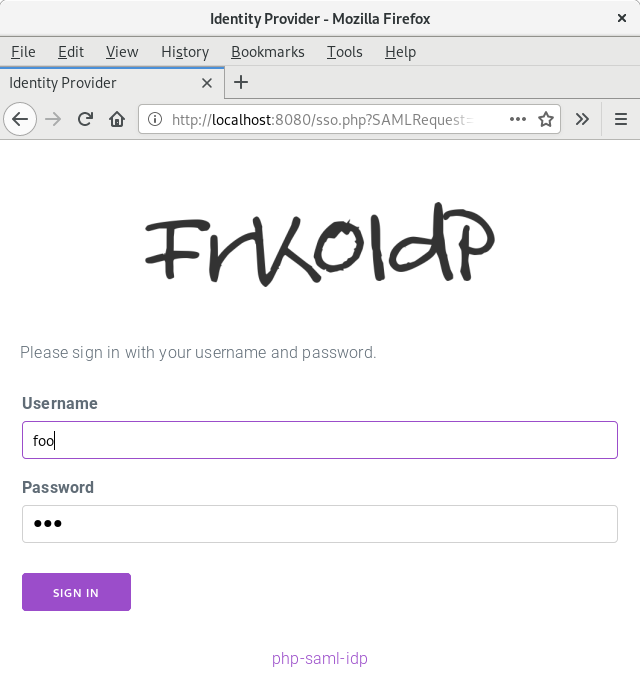
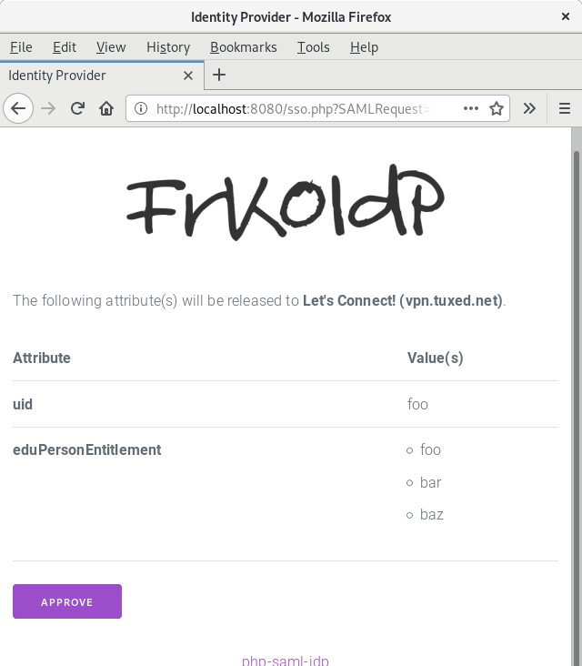

**DO NOT USE**

Very simple SAML 2.0 IdP.

# Features

- PHP >= 5.4 (including latest 7 release)
- **Only** IdP functionality
- Metadata URL
- HTTP POST binding for SAML Response
- HTTP Redirect binding for AuthnRequest
- Only supports RSA+SHA256 signed assertions/requests
- **No** encryption support
- As simple as possible (only compat / helper libraries, **no** xmlseclibs)
- Simple Authentication (username & password hash config entries)
- LDAP Authentication
- Attribute Mapping (from LDAP to e.g. OID)
- Attribute Mapping / Filtering (per SP)
- Subject Identifier (pairwise-id) support
- Consent Page
- Only "transient" NameID support
- Logout (SLO)
- Verifies `AuthnRequest` and `LogoutRequest` signatures if SP public key is
  known

# Screenshots

# Compatibility

We tested with:

- [simpleSAMLphp](https://simplesamlphp.org/)
- [mod_auth_mellon](https://github.com/UNINETT/mod_auth_mellon/)
- [OpenConext](https://openconext.org/)

# Installation

Git clone the repository. Use [Composer](https://getcomposer.org/) to install
the dependencies:

    $ git clone https://git.tuxed.net/fkooman/php-saml-idp
    $ cd php-saml-idp
    $ composer install

# Configuration

## SP 

    $ cp config/config.php.example config/config.php
    $ cp config/metadata.php.example config/metadata.php

Modify `config/config.php` to configure the IdP, modify `config/metadata.php` 
to add your SP(s).

Generate a salt:
    
    $ php bin/generate-salt.php

And use that for `secretSalt` in the `config/config.php` file.

## Generate X.509 Certificates

    $ openssl req \
        -nodes \
        -subj "/CN=SAML IdP" \
        -x509 \
        -sha256 \
        -newkey rsa:3072 \
        -keyout "config/server.key" \
        -out "config/server.crt" \
        -days 3600

# Run

    $ php -S localhost:8080 -t web/

# TODO

- include SP metadata import script
- implement encrypted assertions (implement "Key Transport"?)
- implement internationalization
